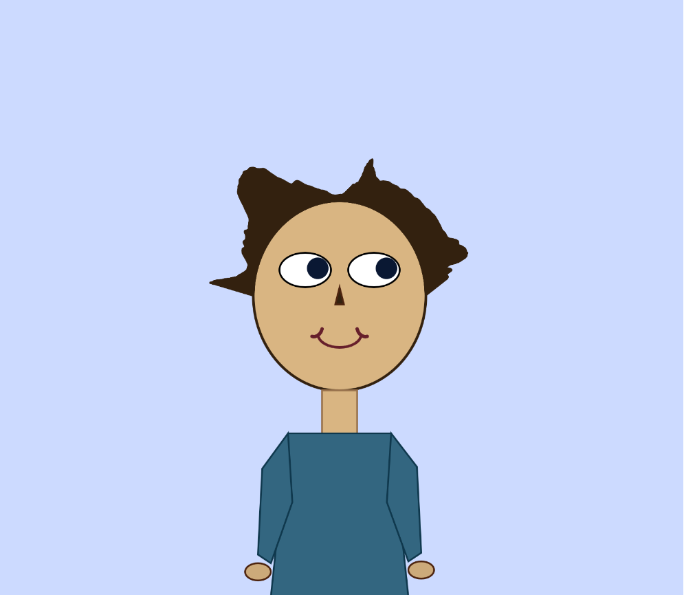

Procedural-Lee

By Jason Lee

[View this project online](URL_FOR_THE_RUNNING_PROJECT)

## Description

This Project showcases my self-portrait in p5.js. I wanted to do something procedural-like despite some errors. I did research on youtube videos as well as used the P5 reference site that showcases sine, cosine, lerp, map and etc, that fits what I was looking for. 
For user interaction, I tried to make the mouse moves so that the portrait face showcases some emotion depending where you put your mouse. This would give the user some interaction with the canvas and I made a changing background to give some procedural/interactive feeling.

## Screenshot(s)

This bit should have some images of the program running so that the reader has a sense of what it looks like. For example:

>  (./assets/images/Sad Face.png)

## Attribution

This bit should attribute any code, assets or other elements used taken from other sources. For example:

> - This project uses [p5.js](https://p5js.org).
> - I didn't take any code from a person's work but I wanted to give recognition to the helpful videos from @ColorfulCoding
on Youtube for explaining sine and cosine aside from the P5 reference.

## License

This bit should include the license you want to apply to your work. For example:

> This project is licensed under a Creative Commons Attribution ([CC BY 4.0](https://creativecommons.org/licenses/by/4.0/deed.en)) license with the exception of libraries and other components with their own licenses.