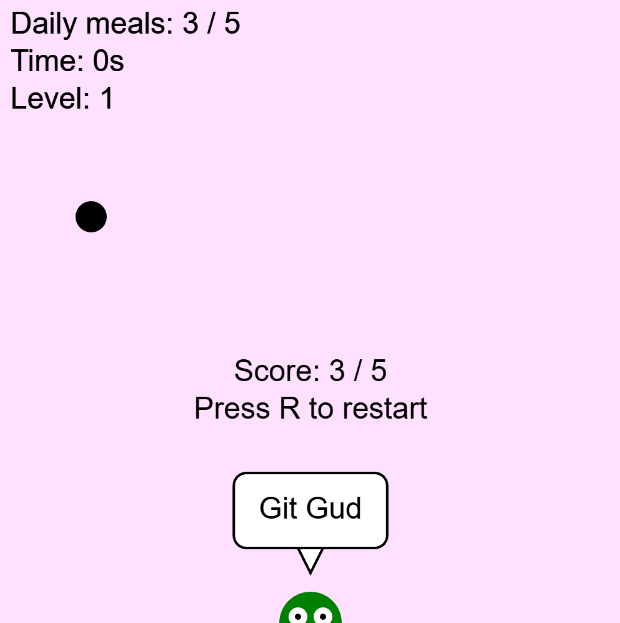
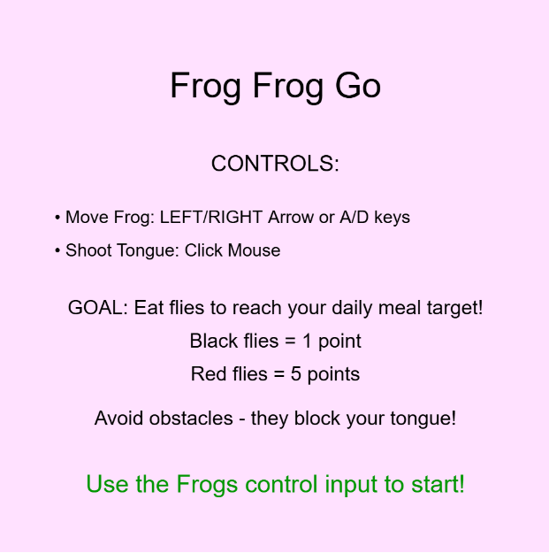
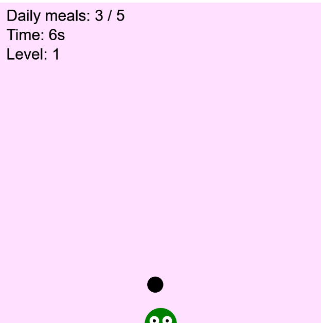

Frog Frog Go

Jason Lee

[View this project online](https://lee-sifu.github.io/cart253-2025-Fall-/mod-jam/)

## Description

My mod jam, Frog Frog Go, is a fast-paced arcade style game where you control a hungry frog trying to meet its daily meal quota before time runs out!
I used the professor's original frogfrogfrog file as reference and added some of my own changes. One of the main things I did was add a timer for users to keep going, another fly that gives more points, level system that keeps people engaged, obstacles that spawn in every level for more difficulty and finally an array of messages whether you win or lose.
For the timer, it creates urgency and increases with each level (starts at 15 seconds, +15s per level)
For my second fly it adds a +5 point bonus so it gives players a sense of satisfaction. Also both flies have random movement so they act like real flies.
For my level system, the level increases the target score by 5 flies and spawns additional obstacles, keeping players engaged with escalating difficulty.
With obstacles spawning it blocks your frog's tongue mid-extension, forcing strategic aiming and adding spatial puzzle elements.
In my array of win/lose messages, they are a mix of internet slangs and other funny/motivational messages compared to the usual "You win/Game Over" messages. I also added a speech bubble around the frog so it seems like its talking to players.
I added free and open source sound effects to give more immersion with randomized pitch variation (0.9-1.1x) for tongue shots, eating, fly spawns, wins, and losses.
I added an instruction screen but also added a functionality where the player has to press one of the frog's input to start. Also added a 3-second delay before showing the restart button to let players process their loss.
Lastly I added optional key movements where you can use the A/D keys or Arrow keys compared to using the mouse.x position. As well as give players control over how they aim and shoot the frog's tongue.

## Screenshot(s)

This bit should have some images of the program running so that the reader has a sense of what it looks like. For example:

> 

## Attribution

This bit should attribute any code, assets or other elements used taken from other sources. For example:

> - This project uses [p5.js](https://p5js.org).
> - This project used Pippin's frogfrogfrog file as reference.(https://pippinbarr.com/cart253/topics/making/examples/frogfrogfrog.zip)
> - The sound effects for my mod jam are all royalty-free and credits go to "Fly"+"Fly fly on the window" by spinopel, "laser-shoot" by freesound_community, "Eat" by Nahtt, "Thud sound effect" by DRAGON-STUDIO, and "yeah boy" by Universfield from pixabay:https://pixabay.com/sound-effects

## License

This bit should include the license you want to apply to your work. For example:

> This project is licensed under a Creative Commons Attribution ([CC BY 4.0](https://creativecommons.org/licenses/by/4.0/deed.en)) license with the exception of libraries and other components with their own licenses.