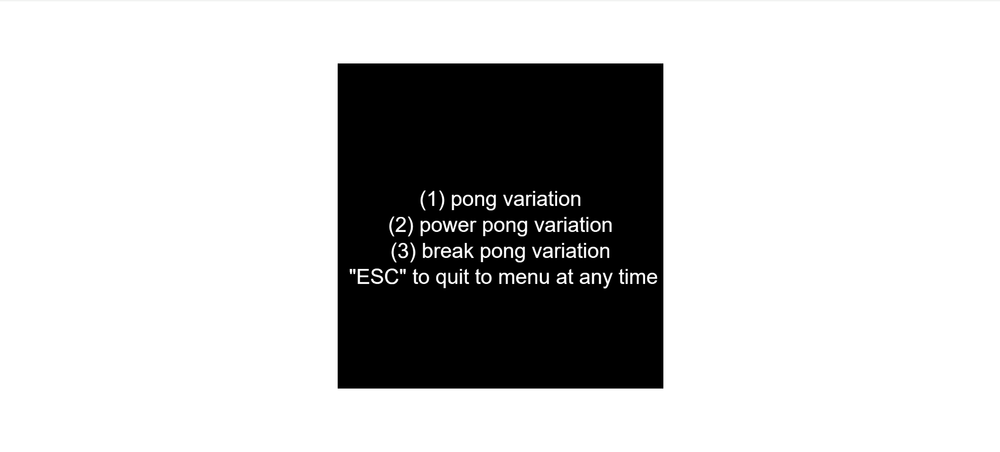
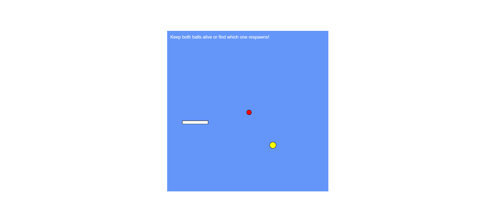
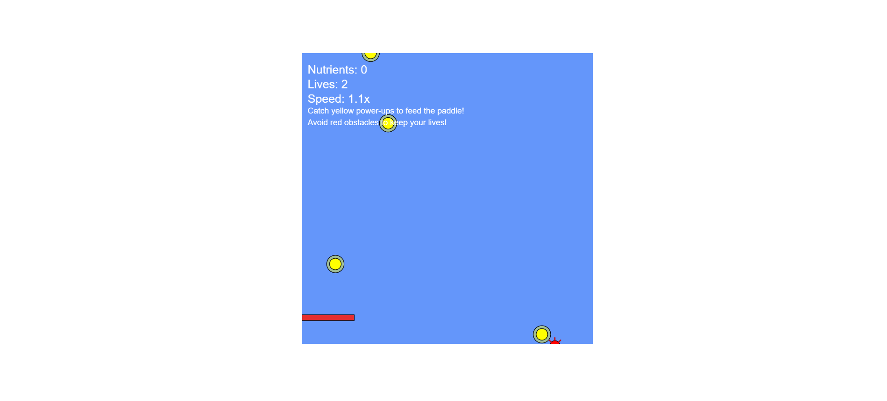
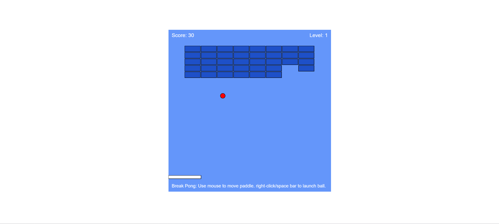
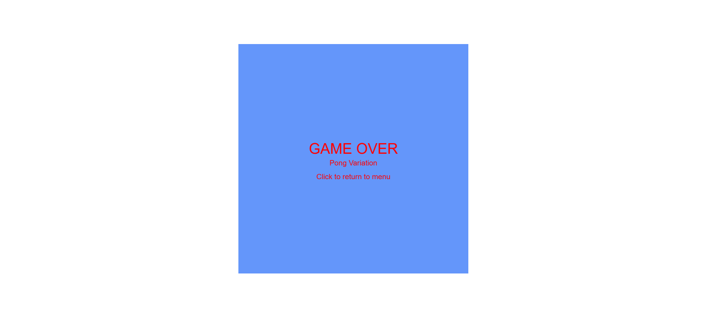

# All Pong Star

Jason Lee

[View this project online](https://lee-sifu.github.io/cart253-2025-Fall-/variation-jam/)

## Description

"All Pong Star" is game where you have a menu system to choose between number 1 to 3 to accesss a pong like game. All three variants are simple and fun experiences base off of Pong but have different surprises. 
My first variant, Pong variant is a two-ball challenge game where each time you play the balls have a randomize function. One ball respawn and second ball ends the game. All while keeping the two balls alive simultaneously to test your reflexes.
My second variant, Power Pong variant is a action-packed falling object game where your paddle must catch yellow power-ups (nutrients) while dodging red obstacles with dangerous spikes. Rack up points by collecting nutrients and the paddle changes color to symbolize its growth, but be careful the hitting obstacles costs you lives! The game progressively increases in difficulty with faster spawn rates and movement speed, creating an increasingly intense survival challenge.
Finally my third variant, Break Pong is a classic breakout-style game with progressive difficulty. Destroy all the colored bricks on each level by bouncing the ball off your paddle. As you advance through levels, the ball increases in speed, more bricks spawn each level with after level 3 bricks will spawn at random positions and bricks changes color each level symbolizing your progression.
One of the things I would of added if I had more time would be sounds to give my variant jam some immersion and maybe adding and changing some stuff to all three variants.

## Screenshot(s)

This bit should have some images of the program running so that the reader has a sense of what it looks like. For example:

> 
> 
> 
> 
> 

## Attribution

This bit should attribute any code, assets or other elements used taken from other sources. For example:

> - This project uses [p5.js](https://p5js.org).
> - This project uses the teacher's menu variation file.
> - Pong was my inspiration for this variation jam. 

## License

This bit should include the license you want to apply to your work. For example:

> This project is licensed under a Creative Commons Attribution ([CC BY 4.0](https://creativecommons.org/licenses/by/4.0/deed.en)) license with the exception of libraries and other components with their own licenses.